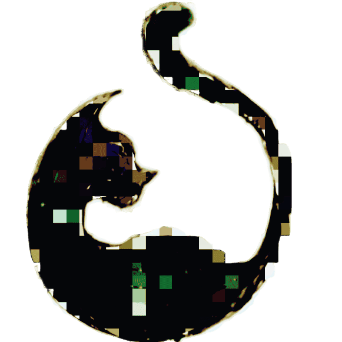

# Miao

 |  |  | 

<div align="center">

  

  <p>A Python script for generating CMake files, with a user-friendly, Cargo-like command line interface. (UNDER CONSTRUCTION)</p>

</div>

<br>

---

TODO:

<br>

- ☑ miao help
- ☑ miao new
  - ☑ miao new --language --standard 
  - ☐ miao new --lib
- ☑ miao build
- ☑ miao run
- ☑ miao clean
- ☐ miao init
- ☐ miao add
- ☐ miao remove
- ☐ miao config

<br>

## Installation

```bash
pip3 install miao-make
```

## Usage

```bash

# Creating a new project

$ miao new 'hello world' --language cpp --standard 20
 Created   hello_world
 Added     CMakelists.txt
 (debug)   ```set(CMAKE_CXX_STANDARD 20)
        file(GLOB_RECURSE SOURCES "src/*.cpp")```
 Created   src/ directory
 Added     main.cpp
 Created   build/ directory


# Run it!

$ cd hello_world/
$ miao run
 root:     /Users/Me/dev/python/miao/src/hello_world
 pwd:      /Users/Me/dev/python/miao/src/hello_world
 Entering  /Users/Me/dev/python/miao/src/hello_world/build
-- The C compiler identification is AppleClang 13.0.0.13000029
-- The CXX compiler identification is AppleClang 13.0.0.13000029
-- Detecting C compiler ABI info
-- Detecting C compiler ABI info - done
-- Check for working C compiler: /Applications/Xcode.app/Contents/Developer/Toolchains/XcodeDefault.xctoolchain/usr/bin/cc - skipped
-- Detecting C compile features
-- Detecting C compile features - done
-- Detecting CXX compiler ABI info
-- Detecting CXX compiler ABI info - done
-- Check for working CXX compiler: /Applications/Xcode.app/Contents/Developer/Toolchains/XcodeDefault.xctoolchain/usr/bin/c++ - skipped
-- Detecting CXX compile features
-- Detecting CXX compile features - done
-- Configuring done (1.0s)
-- Generating done (0.0s)
-- Build files have been written to: /Users/Me/dev/python/miao/src/hello_world/build
[ 50%] Building CXX object CMakeFiles/hello_world.dir/src/main.cpp.o
[100%] Linking CXX executable hello_world
[100%] Built target hello_world
===========================2023-06-22 07:28:14.553143==========================
Running /Users/Me/dev/python/miao/src/hello_world/build/hello_world
===============================================================================
Hello, world!


# Cleaning up

$ miao clean
Removing /Users/Me/dev/python/miao/src/hello_world/build

```
